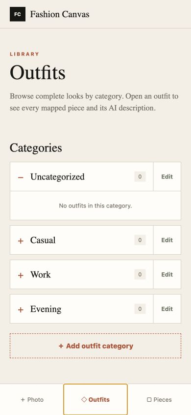

# Fashion Canvas

> [!IMPORTANT]
> **This entire repository, including the application, design, tests, documentation, and deployment setup was made with AI.**

An Expo React Native wardrobe app that captures a mirror selfie, uploads it to Fashion Canvas Server, and saves the generated outfit and separately identified pieces with every AI-provided description.

## Screenshot



## Features

- Camera page with camera and photo-library capture, upload progress, generated outfit preview, and category selection for the outfit and every piece.
- Outfits and Pieces pages grouped into compact category accordions with configurable 2/3/4-column grids.
- Settings page for outfit and piece category management plus independent grid-density controls.
- Same-category pieces can be merged while saving an AI result or from piece details; outfit links and AI descriptions are preserved.
- Linked outfit and piece detail sheets with bidirectional navigation and AI-provided descriptions.
- Local-only persistence: metadata and relationships in AsyncStorage, images in Expo FileSystem on Android/iOS, and image blobs in IndexedDB on web.
- Deleting a category safely moves its contents to `Uncategorized`.

## Development

```sh
cp .env.example .env
npm ci
npm start
```

Set `EXPO_PUBLIC_FASHION_CANVAS_API_URL` to the reachable Fashion Canvas Server origin. A physical phone cannot reach a server through the phone's own `localhost`; use a development-machine LAN address or a deployed HTTPS endpoint.

Run verification with:

```sh
npm run typecheck
npm run build
npm test
npm run test:e2e
```

`npm test` includes enforced coverage thresholds for the testable business-logic modules (98% lines, 97% branches, and 100% functions). `npm run test:e2e` runs the complete Playwright browser-flow suite with mocked success, rate-limit, malformed-response, and unavailable-server scenarios. Native permissions, icons, and device filesystem integration still require an iOS/Android simulator or physical-device smoke test.

## Android builds

Install EAS CLI and authenticate once:

```bash
npm install --global eas-cli
eas login
eas init
```

`eas init` creates or links the Expo project and writes its project ID into the app configuration.

Configure the public production API URL in the Expo `production` and `preview` environments before building:

```bash
eas env:create --name EXPO_PUBLIC_FASHION_CANVAS_API_URL --environment preview --visibility plaintext
eas env:create --name EXPO_PUBLIC_FASHION_CANVAS_API_URL --environment production --visibility plaintext
```

Create an APK that can be installed directly on an Android device:

```bash
eas build --platform android --profile preview
```

Create a signed release APK that uses the production environment:

```bash
eas build --platform android --profile production-apk
```

Create an Android App Bundle for Google Play:

```bash
eas build --platform android --profile production
```

For local Android development with Android Studio and the Android SDK installed:

```bash
npx expo run:android --device
```

### Mobile scripts

Local run and release commands:

```bash
npm run android
npm run android:device
npm run android:release
npm run ios
npm run ios:device
npm run ios:release
```

EAS preview and production builds:

```bash
npm run android:build
npm run android:build:apk
npm run android:build:store
npm run ios:build
npm run ios:build:release
npm run ios:submit
```

The local release commands require Android Studio/Android SDK or Xcode respectively. EAS build and submit commands require an authenticated EAS CLI session.

## Persistence note

Metadata and relationships are stored in AsyncStorage. Images are stored separately in Expo FileSystem on Android/iOS and IndexedDB on web; only stable image references are kept with the library metadata.

## CI

The Gitea pipeline performs an uncached install in separate build, unit-test, browser-E2E, and image-publishing jobs. The published container is a web preview of the same Expo application; native iOS and Android releases should be signed through an appropriate mobile release workflow.

## License

MIT
